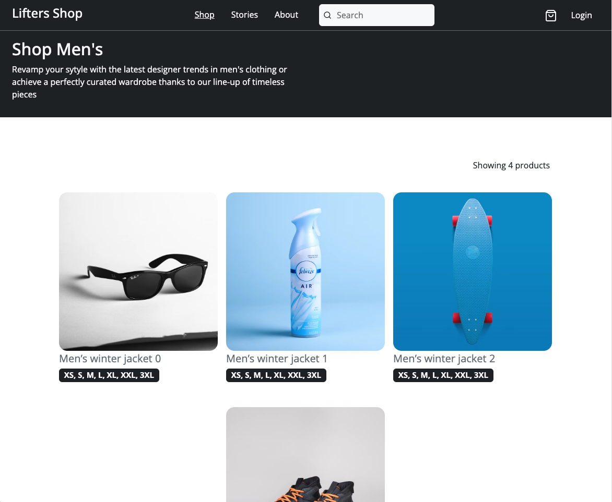

<h1 align="center">
    Lifters E-commerce
    <br>
    
</h1>

<h4 align="center">
  Your ultimate destination for the latest trends in men's clothing.
</h4>


<p align="center">
  <a href="#rocket-technologies">Tecnologias</a>&nbsp;&nbsp;&nbsp;|&nbsp;&nbsp;&nbsp;
  <a href="#information_source-how-to-use">Como Usar</a>&nbsp;&nbsp;&nbsp;|&nbsp;&nbsp;&nbsp;
  <a href="#memo-license">Licença</a>
</p>

<p align="center">
  
</p>

## 🚀 Tecnologias

Este projeto foi desenvolvido utilizando as seguintes tecnologias:

- **[React](https://reactjs.org/)**: Biblioteca JavaScript para construir interfaces de usuário interativas. É a base do seu aplicativo, permitindo a criação de componentes reutilizáveis e a gestão do estado da UI.

- **[React Router](https://reactrouter.com/en/main)**: Biblioteca para gerenciar a navegação e as rotas em aplicações React. No, React Router com hooks foi possível utilizar para setar query params do componente header para a tela de dashboard, permitindo a filtragem via search "nome do produto", categorias e cores.

- **[Redux](https://redux.js.org/)**: Biblioteca para gerenciamento de estado em aplicações JavaScript. No projeto, Redux é utilizado para gerenciar o estado global do carrinho, podendo acessar de vários componentes como o header e o checkout em si, dando a possiblidade de remover, acessar e adicionar a partir do detalhe de um produto.

- **[React Query](https://tanstack.com/query/latest)**: Biblioteca para gerenciar e sincronizar estados de dados assíncronos. No projeto, React Query é utilizado para buscar dados da API, a listagem dos produtos (com filtros e sem) e de forma muito customizada, obter apenas um produto, a ideia não é ir muito profundo nas funcionalidades, mas destacar a biblioteca que tenho utilizado para trabalhar com cache - outra opção teria sido o RTK.

- **[Axios](https://axios-http.com/)**: Biblioteca para fazer requisições HTTP. No projeto, Axios é utilizado apenas para simplificar a base de requisições, poderia ter optado por fetch.

- **[Bootstrap](https://getbootstrap.com/)**: Framework de CSS que ajuda na criação de layouts responsivos e estilizados. Utilizado para fornecer uma base de estilos e componentes prontos que aceleram o desenvolvimento e garantem uma aparência consistente. Tentei evitar fazer customizações personalidas em componentes.

- **[Zod](https://zod.dev/)**: Biblioteca para validação de esquemas em TypeScript e JavaScript. No projeto, Zod é utilizada para validar e garantir que os dados recebidos dos formulários e das APIs estejam no formato esperado.

- **[React Hook Form](https://react-hook-form.com/)**: Biblioteca para gerenciamento de formulários em React. No projeto, React Hook Form é utilizada para lidar com a entrada de dados dos usuários, validar e submeter formulários com uncontrolled componentes.

- **[React Helmet Async](https://github.com/galgregor/react-helmet-async)**: Biblioteca para gerenciar e atualizar o conteúdo do `<head>` do documento, como títulos e meta tags, de maneira assíncrona, melhorando a experiência de SEO e a gestão de informações da página.

- **[Redux Persist](https://github.com/rt2zz/redux-persist)**: Biblioteca para persistir e reidratar o estado do Redux entre sessões. No projeto, Redux Persist é utilizado para manter os dados do estado global, como o conteúdo do carrinho de compras, mesmo após o fechamento e reabertura do navegador.

- **[Sonner](https://github.com/sonnerjs/sonner)**: Biblioteca para exibir notificações e alertas de forma elegante e configurável. Utilizada para fornecer feedback visual ao usuário sobre ações realizadas, como a adição de itens ao carrinho ou erros durante o checkout.

- **[Vite](https://vitejs.dev/) with [vite-tsconfig-paths](https://github.com/aleclarson/vite-tsconfig-paths)**: Ferramentas modernas para build e desenvolvimento rápido de aplicações JavaScript e TypeScript. Vite é utilizado para um desenvolvimento ágil e eficiente, enquanto o `vite-tsconfig-paths` facilita o gerenciamento de caminhos no TypeScript.

## 🤔 Como Usar

Para clonar e rodar esta aplicação, você precisará de [Git](https://git-scm.com), Node.js v18.13.0 ou superior e pnpm instalado no seu computador - utilizo o nvm para trabalhar com versões distintas do node. No seu terminal:

```bash
# Clone este repositório
$ git clone https://github.com/thereallucas98/e-commerce-web-app

# Entre no diretório do repositório
$ cd e-commerce-web-app

# Instale as dependências
$ npm install or pnpm i

# Rode o projeto em modo de desenvolvimento
$ npm run dev or pnpm run dev

# Compile o projeto para produção
$ npm run build or pnpm run build